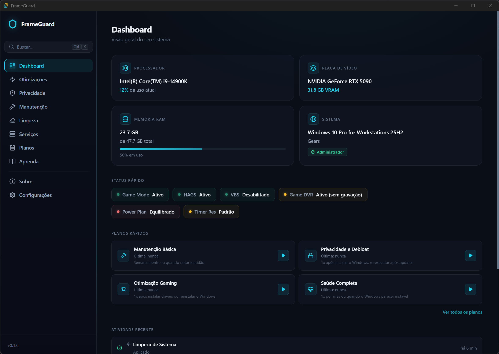
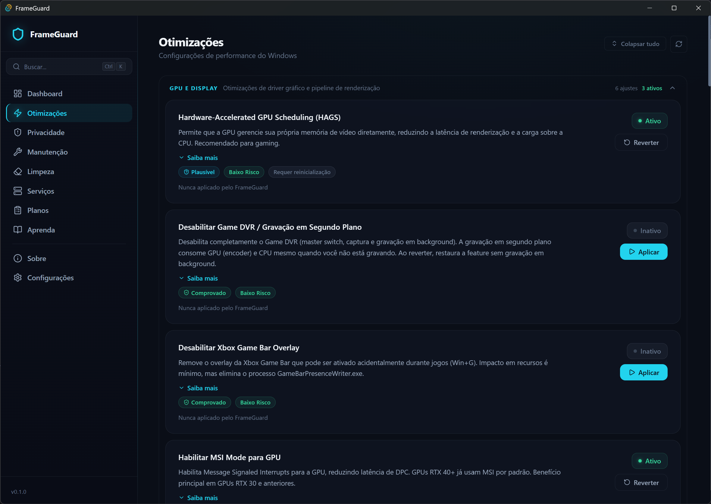
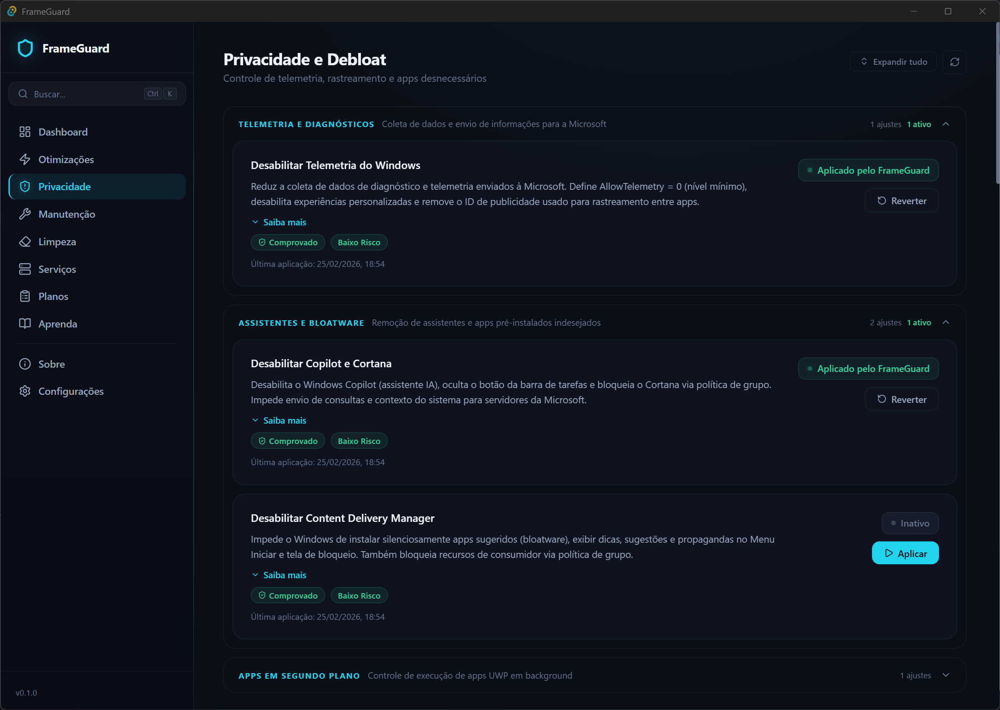
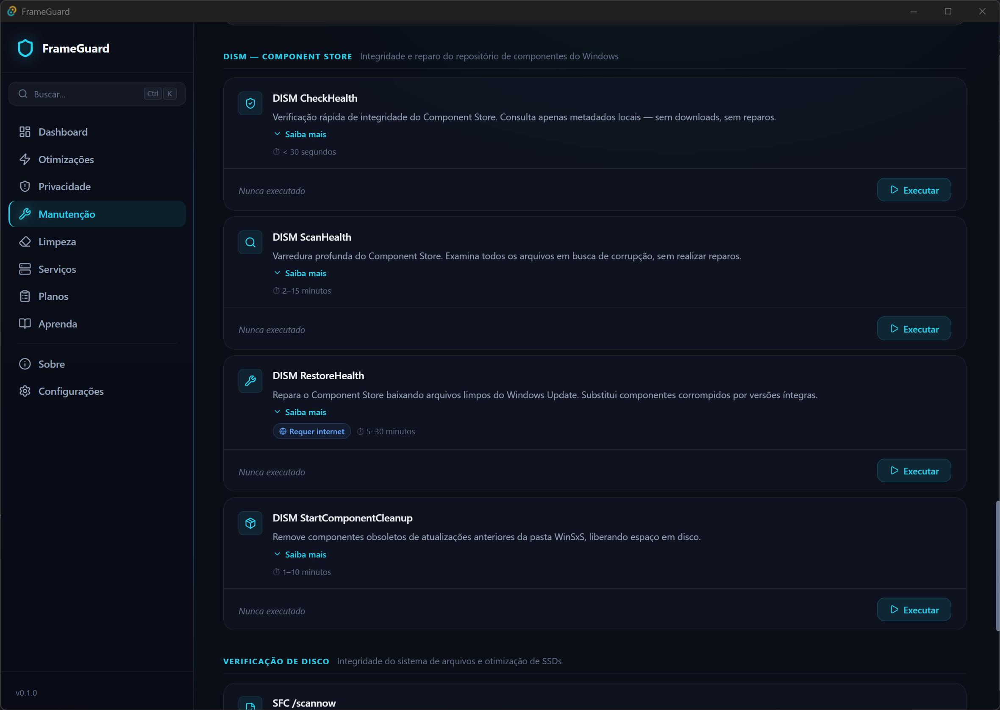

<p align="center">
  
</p>

<h1 align="center">FrameGuard</h1>

<p align="center">
  Utilitário de manutenção e otimização para <strong>Windows 11</strong>, feito por gamers, para gamers.<br>
  Interface moderna, backend nativo em Rust e zero telemetria.
</p>

<p align="center">
  
  
  
  
  
</p>

<p align="center">
  <a href="https://github.com/marcelopepis/FrameGuard/releases">Download</a> ·
  <a href="#screenshots">Screenshots</a> ·
  <a href="#features">Features</a> ·
  <a href="#instalação">Instalação</a> ·
  <a href="#contribuindo">Contribuindo</a>
</p>

---

## O que é o FrameGuard?

O FrameGuard é uma ferramenta **gratuita e open-source** que reúne otimizações, manutenção e limpeza do Windows 11 em um único lugar — sem bullshit, sem snake oil, sem telemetria.

Cada tweak tem classificação de evidência (comprovado, plausível ou não comprovado), detalhes técnicos completos e reversão com um clique. Você decide o que aplica, sabendo exatamente o que vai acontecer.

## Screenshots

<p align="center">
  <br>
  <em>Dashboard — Visão geral do hardware, status do sistema e planos rápidos</em>
</p>

<p align="center">
  <br>
  <em>Otimizações — 21 tweaks organizados por categoria com níveis de risco e evidência</em>
</p>

<p align="center">
  <br>
  <em>Privacidade — Controle de telemetria, remoção de bloatware UWP e apps em segundo plano</em>
</p>

<p align="center">
  <br>
  <em>Manutenção — DISM, SFC, chkdsk, TRIM e flush DNS com progresso em tempo real</em>
</p>

## Features

**Otimizações**
- 21 tweaks de GPU, CPU, rede, armazenamento e timers com classificação de evidência
- Filtro automático por hardware — detecta GPU (NVIDIA/AMD/Intel) e CPU, exibe apenas tweaks compatíveis
- Backup automático do valor original antes de cada alteração; reversão com um clique

**Privacidade**
- 4 tweaks de privacidade e telemetria (registro + política de grupo)
- Remoção de bloatware UWP em batch com lista curada de 41 apps
- Controle de apps em segundo plano

**Manutenção**
- DISM (CheckHealth, ScanHealth, RestoreHealth), SFC, chkdsk, SSD TRIM, flush DNS
- Streaming de progresso em tempo real para cada operação

**Limpeza**
- Scan categorizado: temporários do sistema, GPU shader cache, browser cache, cache de apps, avançado (WinSxS)
- Seleção granular por item com detecção de file locks (Restart Manager API)

**Serviços**
- 33 serviços e 8 tarefas agendadas curados para gaming
- Desabilitar/restaurar com um clique

**Planos de Execução**
- Combine múltiplos tweaks em rotinas reutilizáveis
- 4 planos oficiais incluídos: Manutenção Básica, Saúde Completa, Otimização Gaming, Privacidade e Debloat
- Criação de planos personalizados com drag-and-drop

**Mais**
- Busca global (`Ctrl+K`) para encontrar qualquer tweak, ação ou plano
- Ponto de restauração automático antes de planos (configurável)
- Export/import de configurações em arquivo `.fg` (JSON legível)
- Página educacional desmistificando otimizações "snake oil"
- Verificação de atualizações via GitHub Releases

## Requisitos

- Windows 11 (x64)
- Privilégios de administrador (elevação via UAC automática)

## Instalação

### Download direto

Baixe o instalador `.exe` mais recente na página de [Releases](https://github.com/marcelopepis/FrameGuard/releases).

### Build local

```bash
# Pré-requisitos: Node.js 20+, Rust toolchain, Visual Studio Build Tools
git clone https://github.com/marcelopepis/FrameGuard.git
cd FrameGuard
npm install
npm run tauri build
```

O instalador NSIS será gerado em `src-tauri/target/release/bundle/nsis/`.

## Desenvolvimento

```bash
npm run dev          # Vite dev server + Tauri dev (hot reload)
npm run build        # Build de produção (tsc + vite + cargo)
npm run tauri build  # Gera instalador NSIS
```

### Stack

| Camada | Tecnologia | Versão |
|--------|-----------|--------|
| Frontend | React + TypeScript (Vite) | React 19, Vite 7, TS 5.8 |
| Backend | Tauri v2 + Rust | Tauri 2, Edition 2021 |
| Ícones | lucide-react | 0.564+ |
| Roteamento | react-router-dom | 7.13+ |
| Registro | winreg | 0.55 |
| Sistema | sysinfo | 0.33 |

### Estrutura do projeto

```
FrameGuard/
├── src/                    # Frontend React/TypeScript
│   ├── components/         # ActionCard, Layout, SearchBar, Toast, WelcomeModal
│   ├── contexts/           # RunningContext, ToastContext
│   ├── hooks/              # useActionRunner, useHardwareFilter, usePlanExecution
│   ├── pages/              # 10 páginas (Dashboard, Optimizations, Privacy, ...)
│   └── midia/              # Screenshots e assets visuais
├── src-tauri/              # Backend Rust
│   ├── src/commands/       # Comandos Tauri (system_info, optimizations, cleanup, ...)
│   └── src/utils/          # Backup, plan_manager, activity_log, command_runner, ...
└── CLAUDE.md               # Guia de arquitetura e desenvolvimento
```

## Segurança

- Elevação de administrador via `manifest.xml` (UAC nativo do Windows)
- Backup automático de valores originais antes de qualquer modificação
- Detecção de file locks via Restart Manager API
- **Zero telemetria** — nenhuma conexão externa exceto verificação de updates no GitHub
- Configurações salvas em JSON legível em `%APPDATA%\FrameGuard`

## Contribuindo

1. Fork o repositório
2. Crie uma branch (`git checkout -b feature/minha-feature`)
3. Commit suas alterações (`git commit -m 'feat: minha feature'`)
4. Push para a branch (`git push origin feature/minha-feature`)
5. Abra um Pull Request

Consulte o [CLAUDE.md](CLAUDE.md) para detalhes sobre arquitetura, convenções e checklists de implementação.

### Sugestões de tweaks

O FrameGuard só inclui tweaks com evidência real de impacto. Para sugerir um novo tweak, use o [template de sugestão](https://github.com/marcelopepis/FrameGuard/issues/new?template=tweak_suggestion.yml) e inclua detalhes técnicos + evidência.

## Licença

Este projeto está licenciado sob a [GNU General Public License v3.0](LICENSE).

---

<p align="center">
  <strong>Apoie o projeto</strong><br>
  O FrameGuard é gratuito e sempre será. Se ele te ajudou,<br>
  considere um PIX de qualquer valor — todo apoio conta.
</p>

<p align="center">
  
</p>

<p align="center">
  Feito por <a href="https://github.com/marcelopepis"><strong>Marcelo Pepis</strong></a>
</p>
